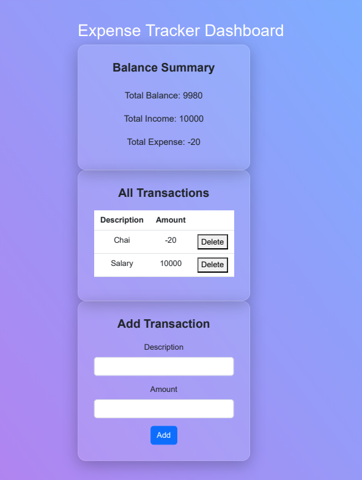

# ExpenseTrackerDashboard

🎯 Project Title: "Expense Tracker Dashboard"
🧩 Concepts Practiced:
JSX: Building structured UI (cards, lists, forms)

useState: Manage expenses, inputs, and balance

useEffect: Sync with localStorage or perform calculations

useRef: Focus input fields or track previous values

Prop Drilling: Pass expense data and handlers down the component tree

💼 What It Does
A simple expense tracker where users can:

Add income and expenses

View a summary of total balance, income, and expenses

View a list of transactions

Delete individual transactions

🧱 Components Breakdown
App – Root component with shared state

BalanceSummary – Displays current balance, income, and expense

TransactionList – Renders list of transactions

TransactionItem – Displays each transaction with delete button

AddTransactionForm – Form to add new transaction

✨ Features to Implement
Add transaction (description, amount)

Positive = income, negative = expense

Delete transaction

Dynamic balance calculation

Input auto-focus using useRef

Store transactions in localStorage using useEffect

Pass state and handlers down from App (prop drilling)

🔁 Sample Data Structure
js
Copy
Edit
{
  id: 1,
  description: "Grocery",
  amount: -50
}
⏱️ Time Allocation Suggestion

Task	Time
Set up + basic components	30 mins
useState + input form	1 hr
useEffect + localStorage sync	45 mins
Transaction list + delete	45 mins
Styling	1 hr
Cleanup + optional features	1 hr
🧪 Optional Enhancements
Category tagging

Filter by income/expense

Monthly summary

Chart (if you want to push your boundaries)
